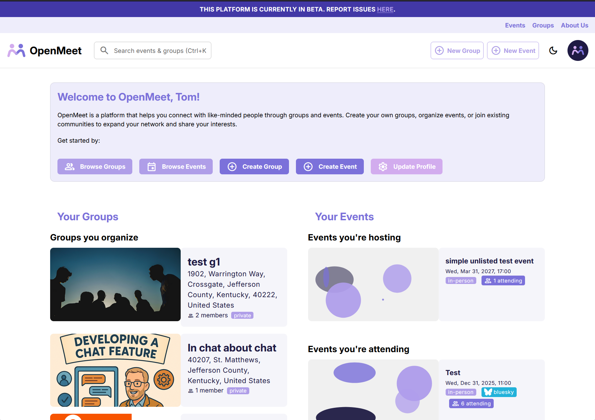
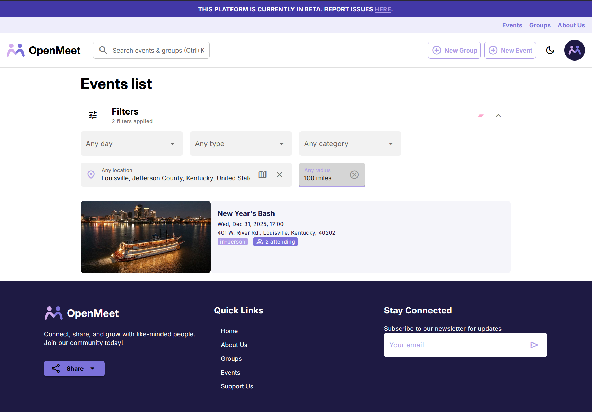
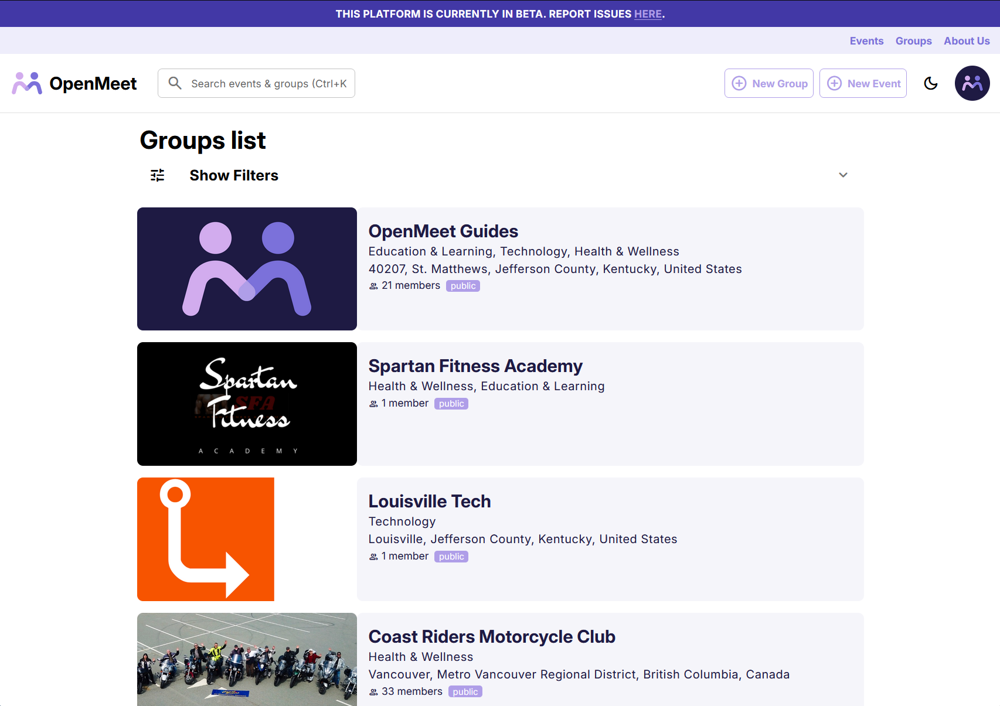
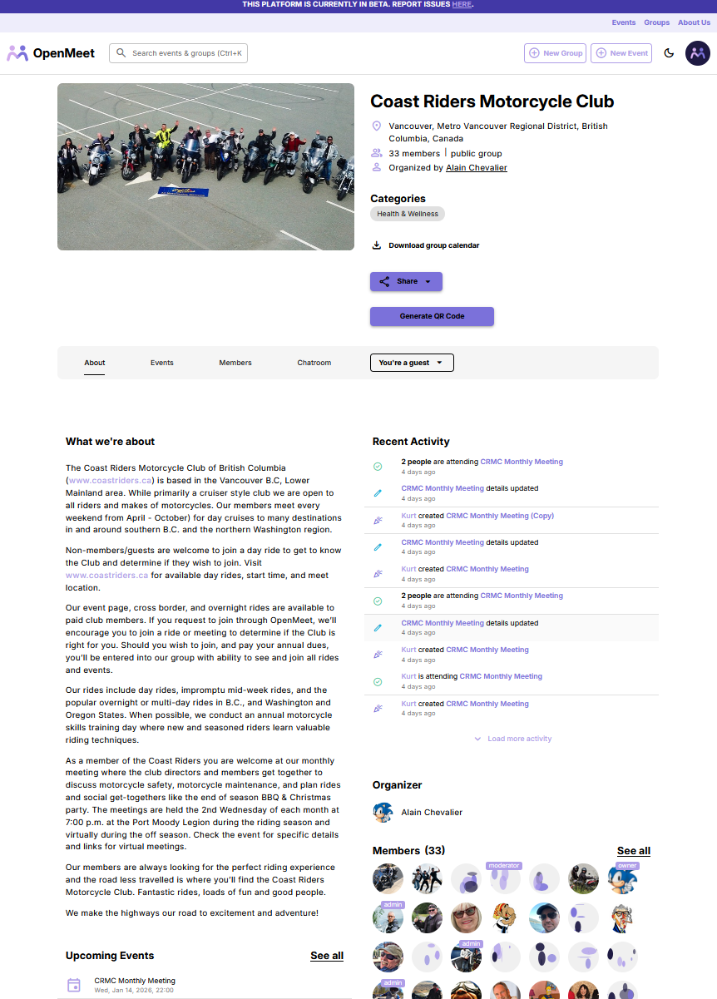
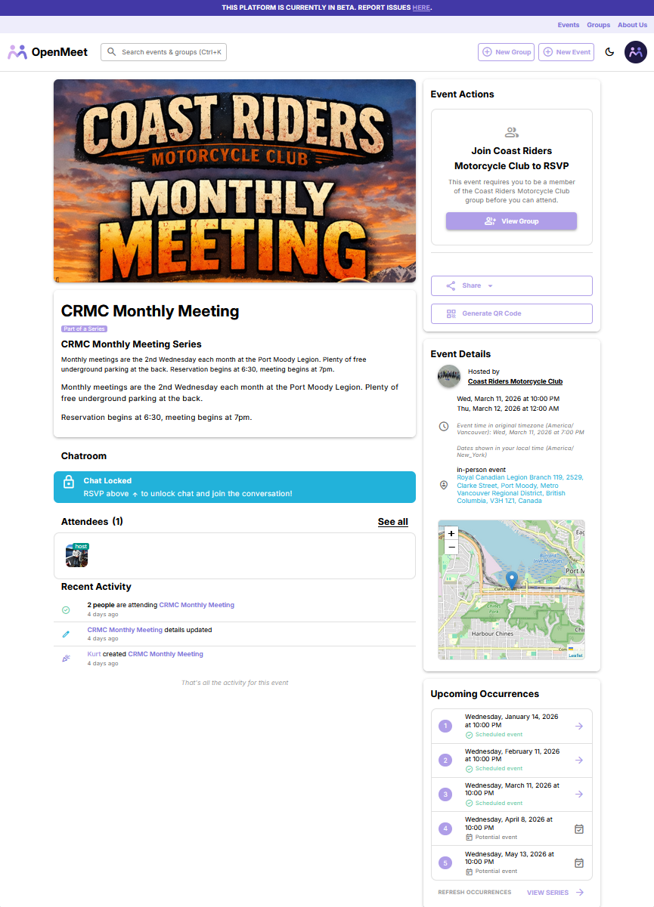
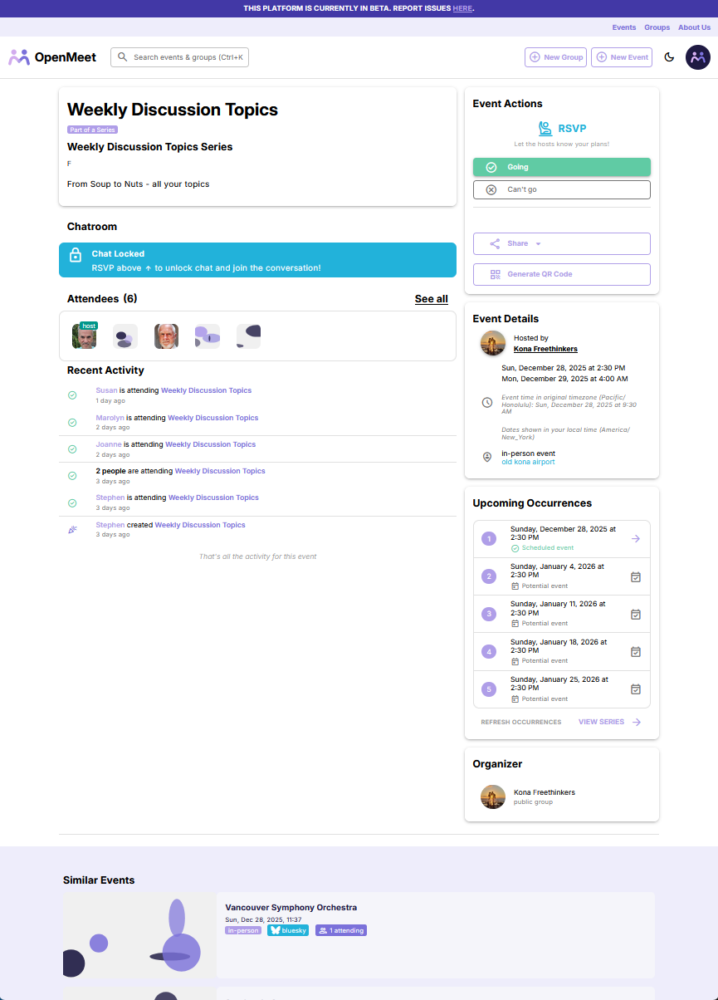

# OpenMeet Platform

[](LICENSE)

The frontend web application for [OpenMeet](https://platform.openmeet.net) — a **free, open-source event platform** for community organizers. Think Meetup, but free for communities and open source.

- **Live:** [platform.openmeet.net](https://platform.openmeet.net)
- **Survey (preview):** [survey.openmeet.net](https://survey.openmeet.net) — AT Protocol-native polling

**[What is OpenMeet? →](https://github.com/OpenMeet-Team/openmeet-api/blob/main/ROADMAP.md)** — Features, roadmap, and how to contribute

---

## Screenshots

<p align="center">
  
  
  
</p>

<p align="center">
  
  
  
</p>

---

## Tech Stack

- **[Vue 3](https://vuejs.org/)** + **[Quasar Framework](https://quasar.dev/)** — Responsive Material Design UI
- **[Pinia](https://pinia.vuejs.org/)** — State management
- **[TypeScript](https://www.typescriptlang.org/)** — Type safety
- **[Vitest](https://vitest.dev/)** — Unit testing
- **[Cypress](https://www.cypress.io/)** — E2E and component testing

### Related Repositories

| Repository | Description | Stack |
|------------|-------------|-------|
| [openmeet-api](https://github.com/OpenMeet-Team/openmeet-api) | Backend API | NestJS, TypeScript, PostgreSQL |
| [openmeet-platform](https://github.com/OpenMeet-Team/openmeet-platform) | Frontend (this repo) | Vue 3, Quasar, TypeScript |
| [survey](https://github.com/OpenMeet-Team/survey) | Survey/polling service | Go, Templ, HTMX |

---

## Development

### Prerequisites
- Node.js v22+
- npm (>= 6.13.4)

### Local Setup

See **[DEVELOPMENT.md](./DEVELOPMENT.md)** for complete instructions including:
- Quick start (npm or Docker Compose)
- Configuration (.env and config.json)
- Running with openmeet-api
- Testing and troubleshooting

### Project Structure

```
src/
├── pages/           # Route pages
├── components/      # Reusable UI components
├── stores/          # Pinia state stores
├── composables/     # Vue composition utilities
├── api/             # API client functions
├── types/           # TypeScript interfaces
├── router/          # Vue Router configuration
├── boot/            # Quasar boot files (plugins)
└── utils/           # Helper functions
```

---

## Contributing

We welcome contributions! Here's how to get started:

1. Check out our [good first issues](https://github.com/OpenMeet-Team/openmeet-platform/issues?q=is%3Aissue+is%3Aopen+label%3A%22good+first+issue%22)
2. Fork the repo and create a feature branch
3. Submit a PR — we review within a few days

See [CONTRIBUTORS.md](CONTRIBUTORS.md) for the people who have helped build OpenMeet.

---

## Community

- **OpenMeet:** [OpenMeet Guides Group](https://platform.openmeet.net/groups/openmeet-guides-gy5j8w) — Community meetups
- **Discord:** [discord.gg/eQcYADgnrc](https://discord.gg/eQcYADgnrc)
- **Bluesky:** [@openmeet.net](https://bsky.app/profile/openmeet.net)

---

## Support OpenMeet

OpenMeet is free for community groups, funded by the community. Help cover hosting costs (~$350/month) at [platform.openmeet.net/support](https://platform.openmeet.net/support).

---

## License

[Apache 2.0](LICENSE)
